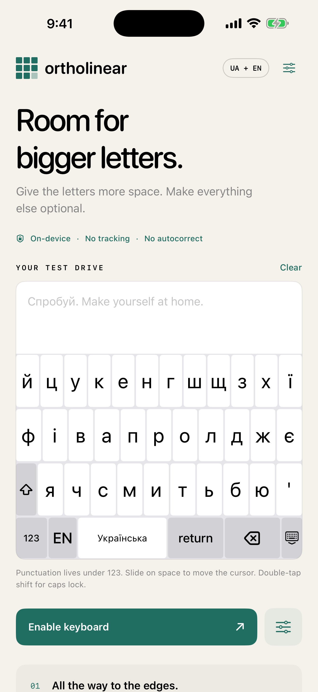

# Ortholinear

A native, private Ukrainian + English keyboard for iPhone and iPad. Straight rows, equal character cells, and configurable geometry. Swift 6, iOS 17+, UIKit keyboard extension, SwiftUI containing app. No third-party dependencies.

[Support](SUPPORT.md) · [Privacy](PRIVACY.md) · [Contributing](CONTRIBUTING.md) · [MIT license](LICENSE)



Actual simulator captures: [iPhone](docs/screenshots/app-store/iphone-home.png) · [iPad](docs/screenshots/app-store/ipad-home.png).

## Run

Open `Ortholinear.xcodeproj`, select the **Ortholinear** scheme and an iPhone simulator, and Run. The app includes an interactive test keyboard that works before you enable the system extension.

For an iPhone or iPad:

1. Set your development team on both the app and keyboard targets in Signing & Capabilities.
2. If necessary, replace the bundle identifiers and `ORTHOLINEAR_APP_GROUP` with identifiers registered to your team. Both targets must have the same App Group entitlement. The app bundle ID must prefix the extension bundle ID.
3. Build and run the app on the device.
4. In iOS Settings, open **General → Keyboard → Keyboards → Add New Keyboard → Ortholinear**.
5. In a text field, use the globe to choose Ortholinear. Full Access is not requested.

Set geometry in the containing app, then dismiss and reopen the system keyboard to load the changes. Use **Test the installed system keyboard** in the app to check the actual extension in text and email fields.

The checked-in Xcode project is ready to open. `project.yml` is the source for regenerating it with [XcodeGen](https://github.com/yonaskolb/XcodeGen):

```sh
xcodegen generate
```

## V0.3.1 behavior

- Ukrainian and English with equal-width letters within each row, including the complete Ukrainian alphabet. English has an optional apostrophe; Ukrainian keeps it on the numbers page.
- Tap г for г; hold it for ґ. With Shift, hold Г for Ґ. There is no separate ґ key.
- Larger default letters: 72 pt keys, 28 pt labels, no header, and no period or comma on the letter page. The remaining letters expand across the row.
- Shift sits immediately before Я / Z on the third letter row. Its position is configurable.
- Substantial Delete immediately after M / Ю on the third letter row, 72 pt tall by default. Return stays on the control row at 56 pt. Both share a dedicated width setting. Numbers and symbols keep Delete on the control row.
- Big letters, Balanced, and Original grid presets; optional letter-page punctuation and header.
- Optional automatic spacing after . , ! ? : ; …, enabled by default. Consecutive punctuation stays together, manual Space does not double the gap, and numeric continuations such as 3.14 work. URL and email fields use literal punctuation.
- UA / EN toggle, one-shot shift, double-tap caps lock.
- Backspace deletes immediately; hold for 420 ms to repeat every 75 ms.
- Space, return, two number/symbol pages, keyboard dismissal. The 123 / ABC switch always stays at the far left of the control row.
- Tap 123 to stay on numbers. Hold or slide from 123 onto a symbol and release to type it, then return to letters. Pause over #+= to reach the second symbols page. Releasing outside or holding and releasing in place cancels.
- Immediate pressed-key feedback and a short release fade, including globe and header dismissal. Key frames stay fixed during feedback; Reduce Motion uses a brief static highlight.
- Native globe interaction when `needsInputModeSwitchKey` is true, including Apple's keyboard picker on hold. On Face ID devices, iOS may supply the globe below the extension instead.
- Hold punctuation for 420 ms, slide into the alternatives at the top of the keyboard, and release on an alternative. Release outside the keyboard to cancel. Available on period, comma, apostrophe, quote, hyphen, and question mark. Without the header, alternatives temporarily overlay the first row.
- Swipe horizontally on space: 12 points per cursor step; no space inserted after a cursor drag.
- Letter-key height: 36–88 pt; control-row height: 36–72 pt; letter size: 18–36 pt; Return/Delete relative width: 1.25–3.5; horizontal spacing: 0–8 pt; vertical spacing: 0–12 pt.
- **Fill gaps between keys** keeps the visible gutters but partitions the whole grid into adjoining touch targets. Turning it off restricts touches to visible rectangles.
- VoiceOver key labels, shift state, and alternative-character actions; system light and dark appearance.
- Numeric input traits start on numbers; email, URL, and ASCII traits start on English. Return labels reflect the host field.

```text
й ц у к е н г ш щ з х ї
ф і в а п р о л д ж є
⇧ я ч с м и т ь б ю ⌫
```

Other controls occupy a fourth row. Character touch cells have equal widths within each row; the narrow Shift key precedes the last row's letters. The two outer visible key faces absorb the outer half-gutter to reach the usable edges. The Original grid preset restores punctuation, the header, and Shift in the control row; ґ remains available by holding г in every preset.

## Privacy and shared settings

`RequestsOpenAccess` is **false**. The app and extension make no network requests. There are no analytics SDKs, typed-text logging, dictionaries, or prediction services. Preview text lives only in memory. Geometry, typing preferences, and starting language are stored locally. See [privacy details](PRIVACY.md).

The containing app atomically writes `geometry.json` into the App Group. The extension only reads it, on appearance. Apple explicitly permits [read-only access to the containing app's shared container without Full Access](https://developer.apple.com/documentation/uikit/configuring-open-access-for-a-custom-keyboard). This is why settings work without giving the keyboard network access. A missing or malformed file falls back to validated defaults.

**Keep simulator code signing enabled.** Normal Xcode simulator builds use ad-hoc signing without a paid team. Disabling signing removes App Group entitlements, so cross-process settings cannot work. An explicit save error appears in the app if the shared container is unavailable.

## Validate

```sh
swift test
xcodebuild -project Ortholinear.xcodeproj -scheme Ortholinear \
  -destination 'platform=iOS Simulator,name=iPhone 17 Pro' \
  -derivedDataPath build test
```

Core tests cover the complete Ukrainian alphabet, presets and preference migration, Shift and page-switch placement, action-key sizes, exhaustive sampled hit coverage across 320–1024 pt widths, visible-gap mode, and shift/caps transitions. UI tests exercise actual touch delivery in the preview, customization persistence, language switching, symbols, hold/quick symbol slides and cancellation, return, delete hold, cursor drag, punctuation hold, caps lock, onboarding, and landscape layout.

For the separate system-extension integration test, use an English-language disposable simulator and turn off **Simulator → I/O → Keyboard → Connect Hardware Keyboard** so the software keyboard is visible:

```sh
xcodebuild -project Ortholinear.xcodeproj -scheme OrtholinearSystemTests \
  -destination 'platform=iOS Simulator,name=iPhone 17 Pro' \
  -derivedDataPath build test
```

This test enables Ortholinear in Settings, selects it with the system globe picker, types into a real host field, and verifies that the extension reads a changed key height from the app's shared container. It resets geometry to defaults afterward and leaves the extension enabled on that simulator.

See [device checks](docs/DEVICE-CHECKS.md) for the remaining checks before distribution.

## Structure

```text
App/                 Setup, geometry settings, typing preview, system test fields
KeyboardExtension/   UIInputViewController and textDocumentProxy integration
Core/                Layouts, input state, preferences, pure geometry
SharedUI/            UIKit touch surface, accessibility, shared settings reader
Tests/               Swift Package core tests
UITests/             XCUITest interaction tests
IntegrationTests/    Separate real-extension launch and shared-settings regression
Resources/           App icon and privacy manifest
```

## Deliberately later

Autocorrect and suggestions; automatic sentence capitalization; smart quotes and double-space period; haptics; extra geometry modes (stagger, handedness, offsets, individual key widths). No dictionary or third-party keyboard framework is bundled.

iOS replaces custom keyboards in secure/password and phone-pad fields. Host apps can refuse third-party keyboards. These are [system restrictions](https://developer.apple.com/documentation/uikit/configuring-a-custom-keyboard-interface).

Licensed under MIT.
