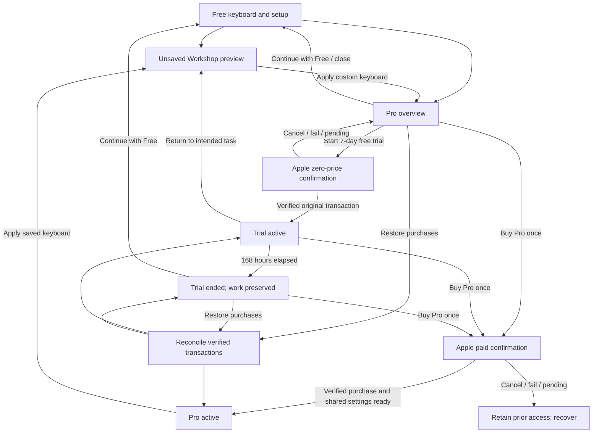

# Pro upgrade flow and interface specification

Status: proposed UX, not shipping UI. Companion to [the product plan](PRO.md) and [implementation plan](PRO-IMPLEMENTATION.md).

Open [the interactive prototype](pro-upgrade-prototype.html) locally to walk through the main states. It simulates product loading, Apple confirmation, errors and transactions; it does not implement StoreKit, a working layout editor, persistent entitlements or system keyboard activation. The rules in these documents are authoritative when a prototype interaction is simplified.

## Experience in one line

**Use Free → explore a custom layout → explicitly start seven days → use the full Pro toolkit → choose a one-time purchase or keep Free.**

The trial is the primary commercial path. Users may decline it, restore an existing purchase, or buy directly. Do not require someone to buy in order to start a free trial, and do not make a previous purchaser redeem a trial to recover access.

## Visual direction

Extend [the existing SwiftUI shell](../App/ContentView.swift): warm paper background, deep teal accent, rounded typography, quiet bordered cards, and a keyboard example as the product visual. Reuse system semantic colours and the app's dark-mode treatment. No separate neon subscription funnel, coin imagery, timers in red, fabricated discounts or fake testimonials.

Design targets: 22 pt horizontal content inset, approximately 16–24 pt between sections, 12–16 pt card radii, and a primary button around 50 pt tall. These are design targets, not a mandate to break Dynamic Type. Controls should have at least a 44 pt interaction target. Large text must scroll rather than truncate price, dates, consequences or dismissal actions.

On iPhone use a navigable sheet/page with visible Close/Back and a bottom action region that does not cover the content. On iPad retain a readable centred column; a wider feature preview may sit alongside the explanation. In landscape and accessibility sizes allow the action region to join the normal scroll flow. Do not put an offer sheet above the real system keyboard while the person is typing in another app.

## Entry points

| Entry | Behaviour |
| --- | --- |
| Home, after setup/test-drive controls | A small Make it yours with Pro card opens the overview. Never auto-present on first launch. |
| Settings → Ortholinear Pro | Persistent status destination: available, trial, ended, purchased, or checking. |
| Workshop preview → Apply custom keyboard | Explain that applying requires Pro, present the offer, and retain the draft and intended action. |
| New custom layer/profile or import | Allow inspection, clearly mark Pro, and use the same offer rather than a separate paywall implementation. |
| Trial status in the app | Show exact end date and access details; purchase is optional. |
| Keyboard extension | No commercial entry point, upgrade badge, sales copy, notification or app-launch workaround. |

Store a non-sensitive `UpgradeIntent` describing the source screen and draft ID. It must not contain typed text. Closing the offer returns to the source with the unsaved work intact. The flow cannot automatically apply a draft after payment without the person's confirmation.

## Screen U1 — Free discovery

Keep Enable keyboard, Test drive and current Settings dominant. The new card reads:

> **Make it yours with Pro**
>
> Rearrange keys. Add your own symbol and phrase layers. Save your setups.
>
> **Explore Pro**
>
> Try all Pro features free for 7 days. No automatic charge.

Free does not require trial activation. Do not show a modal after a particular number of keystrokes or infer usage across apps. Existing users get the same optional card without a migration interstitial.

## Screen U2 — Workshop preview before the trial

The user selects a built-in starting layout and experiments in an unsaved sandbox. Place a **Preview only** badge near the title and explanatory text near Apply:

> Try changes here for free. Start the trial to save and use a custom keyboard in other apps.

Keep the sample test text local/in memory. Draft editing in this sandbox never changes `geometry.json`, publishes a profile or consumes a trial. The Apply boundary opens U3 with `intent = applyDraft(id)`; Close returns to the same draft. Previously saved trial work may always be inspected and exported, but editing saved profiles is gated after expiry.

## Screen U3 — Trial offer / Pro overview

Hierarchy:

1. Close, small Ortholinear Pro label, headline.
2. Keyboard example showing a meaningful customisation, not decoration.
3. Three brief benefit rows.
4. Duration, optional price and expiry consequences.
5. Primary trial button, secondary Free action, direct-buy option, Restore/Privacy/Support.

Proposed English copy:

> **A keyboard, exactly your way.**
>
> **Layout Workshop** — Move keys and customise their size and long-press characters.
>
> **Your own layers** — Keep symbols and reusable phrases one tap away.
>
> **Saved setups** — Save and share the keyboard you've made.
>
> **7 days free. Then choose.**
>
> Keep Pro for **{localizedPrice} once**, or continue with Free. No automatic charge. Nothing to cancel.
>
> After 7 days, custom editing and custom layouts/layers in the installed keyboard stop. Your work stays saved and exportable. The keyboard returns to your Free setup when next opened.
>
> **Start 7-day free trial**
>
> Continue with Free
>
> Or buy Pro now — {localizedPrice} once
>
> Restore purchases · Privacy · Support

The primary action purchases only the zero-price trial product. The separate direct-buy action purchases only the paid product. Do not use one ambiguous Continue button for both. Neither action is enabled before relevant products and eligibility have resolved. A paid owner is routed to U7, an active trial to U5, and an ended trial to U6 rather than being offered a second trial.

Use actual localized product metadata. During product-loading failure, do not show a made-up price, stale strike-through price, or success-looking CTA. Keep the preview and Free path usable. Starting the trial requires availability of both the free trial product and the paid product so the subsequent price can be disclosed. Restoring is independent of product-price loading.

## Screen U4 — Trial activation and confirmation

Apple owns its transaction/authentication interface. Never recreate it in shipping UI. The prototype labels its substitute **Simulation — Apple confirmation** so it cannot be mistaken for a real purchase.

On verified trial success, persist the original trial date and publish the readable configuration/access snapshot. Then show:

> **Your 7 days start now.**
>
> Pro is available until **{localizedEndDateAndTime}**. You won't be charged automatically.
>
> **Continue customising**

If restoring an already-started trial, say **Your trial is active until {date}**, not Your 7 days start now. The timer comes from the original transaction even when completion was delayed. A pending trial must not falsely display seven days remaining before an actual transaction exists.

When invoked from a draft, Continue returns there and highlights Apply. When invoked from Home, it opens the starter choices. Show a concise instruction after Apply: **Dismiss and reopen the keyboard to load your changes.** Do not ask people to enable Full Access or restart their phone.

If the app has verified access but cannot write to the shared container, show **Pro is active, but we couldn't share it with the keyboard. Retry setup.** Keep the purchase evidence, retain work and never encourage buying again. A fully successful confirmation requires both entitlement persistence and usable shared configuration.

## Screen U5 — Active trial

Use one quiet status card in Settings/Home, not an opening modal:

> **Pro trial · {timeRemaining}**
>
> Ends {localizedEndDateAndTime}. No automatic charge.
>
> **Buy Pro — {localizedPrice} once**

The feature workspace remains the main content. Rounded days-left text is supplementary to the exact date: under 24 hours use Less than a day left rather than 0 days or a false full day. Do not use a seconds counter, push notification permission request, or repeated expiry reminder.

Purchasing early replaces the time-limited entitlement immediately after verification; it does not charge again when the original trial would have ended. Update all trial labels after purchase, including a sheet already open.

## Screen U6 — Trial ended

Present this when the person visits the app's Pro destination or explicitly tries a premium operation. A dismissible Home status card is enough otherwise. Never place this in the keyboard extension.

> **Your Pro trial has ended.**
>
> Your custom layouts and layers are still saved on this device. Unlock Pro to edit and use them again, or continue typing with Free.
>
> **Buy Pro — {localizedPrice} once**
>
> Continue with Free
>
> View saved setups · Export my setups · Restore purchases

Only show real counts of saved configurations, and only when available. Never imply deleted work, invent a personal usage statistic, or threaten to erase data. Export stays available without payment; phrase-containing exports need a privacy warning.

The installed keyboard uses the latest Free baseline on its next presentation after expiry, even if the containing app is not launched. Do not change an open keyboard's geometry or replace a just-tapped key at the deadline. No Pro keys with padlocks, pop-up paywalls or dead key positions in the Free keyboard. Returning to Free should feel like a normal keyboard, not a broken premium one.

## Screen U7 — Purchase success / Pro owner

After verified delivery:

> **Pro is yours.**
>
> One-time purchase. No subscription. Your saved setups are ready.
>
> **Continue customising**

For someone with a saved trial layout, add Apply saved keyboard as an explicit option. A person who changed their Free setup after expiry must not have it overwritten automatically.

Settings shows **Pro · Purchased** plus Restore purchases and Support. Remove sales prompts and trial countdowns. Do not promise cloud sync or sharing eligibility before those capabilities are configured and tested.

## Screen U8 — Restore and recovery

Restore is a user-initiated operation with a loading state. It reconciles the account's existing purchases; it does not start or extend a trial.

| Result | Message / route |
| --- | --- |
| Verified paid unlock | Pro restored. Route to U7. |
| Verified trial with time left | Trial restored. Available until {originalEnd}. Route to U5. |
| Verified trial already ended | Your trial ended on {date}. No new seven-day period. Route to U6. |
| Definitively no purchase | No Pro purchase was found for this App Store account. Keep Free and offer retry/support. |
| Could not check | We couldn't check your purchases. Try again when connected. Preserve known access. Never substitute No purchases found. |
| Refunded/revoked paid purchase | This Pro purchase is no longer active. Work is preserved; show support and current valid access. Do not accuse the user of fraud. |

See [the implementation plan](PRO-IMPLEMENTATION.md) for account changes, cached access, revocation and trial precedence.

## Cross-cutting error states

| State | Required behaviour |
| --- | --- |
| Product metadata loading | Skeleton or Checking availability; no actionable price guess. Dismissal and Free work. |
| Offline before activation | Preview remains usable. Explain that an App Store connection is needed to activate/restore. No trial starts locally. |
| User cancels Apple confirmation | Return to the same task/draft and previous entitlement. No error guilt-trip. |
| Pending / Ask to Buy | Waiting for App Store approval. Do not unlock, consume a local trial, or retry a charge automatically. Continue with current access. |
| Failed/unverified purchase | Could not confirm purchase. Retain prior valid access; retry/restore/support, not another assumed charge. |
| Verified purchase, shared write failure | Access is purchased; setup publication failed. Retry publication without buying again. |
| App terminated during purchase | Reconcile on next launch; deliver once and recover the intended task where safe. |
| Trial expires while editing | Save the current draft safely, disable further premium mutations/Apply, explain inline; export and Free settings remain usable. |
| Price/storefront changes | Reload metadata and ask for the currently displayed product/price. Never treat an old price as locked in. |

## Accessibility and localisation

All controls have descriptive VoiceOver labels and stable identifiers. Price, one-time billing, trial duration and expiry consequences are actual text, not embedded in an image. Announce transaction progress/results through appropriate accessibility status changes; never repeatedly announce a countdown.

Support VoiceOver, increased text size, Reduce Motion, high contrast and keyboard/switch-control navigation. The Workshop needs non-drag movement controls. Close/Free/Restore must remain visible or easily reachable at every text size. Use logical reading order and do not communicate eligibility solely through colour.

Move shipping strings into localisable resources. Start with reviewed English and Ukrainian commercial copy; trial naming and product localization must also be configured in App Store Connect. Use plural-aware duration formatting and localized dates, currency and separators. No hard-coded dollar/euro assumptions.

Suggested test identifiers: `pro-entry`, `pro-preview`, `pro-offer`, `pro-start-trial`, `pro-buy-once`, `pro-continue-free`, `pro-restore`, `pro-status`, `pro-expiry`, `pro-export`, `pro-confirmation`, `pro-retry-publication`.

## Design acceptance walkthrough

A new user enables the free keyboard without seeing a modal offer, previews a custom layout, reads the price and expiry terms, explicitly activates the zero-price trial, applies a setup, sees their exact expiry, and later either buys once or continues with Free. Cancellation at any commercial step preserves their draft and prior access. Their custom work is still exportable after expiry; the installed keyboard never displays sales UI or changes keys under an active gesture.

The HTML prototype exercises the high-level path and mock failures. Native accessibility, StoreKit, extension lifecycle, timekeeping and App Group tests are separate release requirements, not covered by opening the HTML file.
